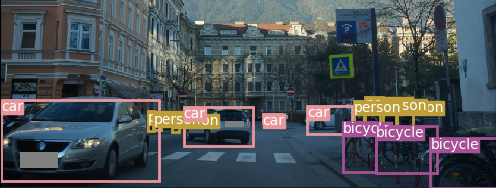
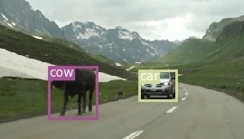
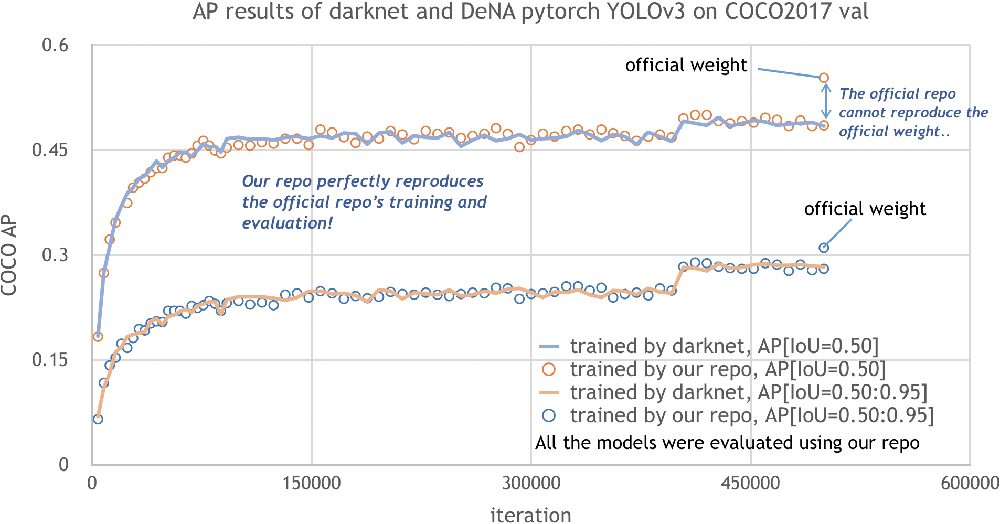

# YOLOv3 in Pytorch
Pytorch implementation of YOLOv3

<p align="left">  </p>

## What's New
- **19/05/05 We have verified that our repo exactly reproduces darknet's training using the default configuration, with COCO AP ~= 0.277 on train / val2017.**
- 19/02/12 verified inference COCO AP [IoU=0.50:0.95] = 0.297 with val2017, 416x416, batchsize = 8 and w/o random distortion
- 18/11/27 [COCO AP results of darknet (training) are reproduced with the same training conditions](#performance)
- 18/11/20 verified inference COCO AP [IoU=0.50:0.95] = 0.302 (paper: 0.310), val5k, 416x416  
- 18/11/20 verified inference COCO AP [IoU=0.50]  = 0.544 (paper: 0.553), val5k, 416x416

## Performance

#### Inference using yolov3.weights
<table><tbody>
<tr><th align="left" bgcolor=#f8f8f8> </th>     <td bgcolor=white> Original (darknet) </td><td bgcolor=white> Ours (pytorch) </td></tr>
<tr><th align="left" bgcolor=#f8f8f8> COCO AP[IoU=0.50:0.95], inference</th> <td bgcolor=white> 0.310 </td><td bgcolor=white> 0.302 </td></tr>
<tr><th align="left" bgcolor=#f8f8f8> COCO AP[IoU=0.50],      inference</th> <td bgcolor=white> 0.553 </td><td bgcolor=white> 0.544 </td></tr>
</table></tbody>

#### Training
The benchmark results below have been obtained by training models for 500k iterations on the COCO 2017 train dataset using darknet repo and our repo.
The models have been evaluated on the COCO 2017 val dataset using our repo.
- Our repo reproduces the results of the darknet repo exactly.  
- The AP of the pretrained weights (yolov3.weights) cannot be reproduced by the default setting of the darknet repo.

<table><tbody><tr><th align="left" bgcolor=#f8f8f8> </th> <td bgcolor=white> darknet weights </td><td bgcolor=white> darknet repo </td><td bgcolor=white> Ours (pytorch) </td><td bgcolor=white> Ours (pytorch) </td></tr>
<tr><th align="left" bgcolor=#f8f8f8> batchsize </th> <td bgcolor=white> ?? </td><td bgcolor=white> 4 </td><td bgcolor=white> 4 </td> <td bgcolor=white> 8 </td> </tr>
<tr><th align="left" bgcolor=#f8f8f8> speed [iter/min](*) </th> <td bgcolor=white> ?? </td><td bgcolor=white> <b>19.2</b> </td><td bgcolor=white> <b>19.4</b> </td> <td bgcolor=white> 21.0 </td> </tr>
<tr><th align="left" bgcolor=#f8f8f8> COCO AP[IoU=0.50:0.95], training</th> <td bgcolor=white> 0.302 </td><td bgcolor=white> <b>0.278</b> </td> <td bgcolor=white> <b>0.277</b> </td> <td bgcolor=white> 0.292 </td> </tr>
<tr><th align="left" bgcolor=#f8f8f8> COCO AP[IoU=0.50],      training</th> <td bgcolor=white> 0.544 </td><td bgcolor=white> <b>0.476</b> </td> <td bgcolor=white> <b>0.478</b> </td> <td bgcolor=white> 0.500 </td> </tr>
</table></tbody>
(*) measured on Tesla V100

<p align="left">

## Installation
#### Requirements

- Python 3.6+
- Numpy (verified as operable: 1.15.2)
- OpenCV
- Matplotlib
- Pytorch (verified as operable: v0.4.0, v1.0.0)
- Cython (verified as operable: v0.29.1)
- [pycocotools](https://pypi.org/project/pycocotools/) (verified as operable: v2.0.0) 
- Cuda (verified as operable: v9.0)

optional:
- tensorboard (>1.7.0)
- [tensorboardX](https://github.com/lanpa/tensorboardX)
- CuDNN (verified as operable: v7.0)

#### Docker Environment

We provide a Dockerfile to build an environment that meets the above requirements.

```bash
# build docker image
$ nvidia-docker build -t yolov3-in-pytorch-image --build-arg UID=`id -u` -f docker/Dockerfile .
# create docker container and login bash
$ nvidia-docker run -it -v `pwd`:/work --name yolov3-in-pytorch-container yolov3-in-pytorch-image
docker@4d69df209f4a:/work$ python train.py --help
```

#### Download pretrained weights
download the pretrained file from the author's project page:   

```bash
$ mkdir weights
$ cd weights/
$ bash ../requirements/download_weights.sh
```

#### COCO 2017 dataset:
the COCO dataset is downloaded and unzipped by:   

```bash
$ bash requirements/getcoco.sh
```

## Inference with Pretrained Weights

To detect objects in the sample image, just run:
```bash
$ python demo.py --image data/mountain.png --detect_thresh 0.5 --weights_path weights/yolov3.weights
```
To run the demo using the non-interactive backend, add `--background` . 

## Train

```bash
$ python train.py --help
usage: train.py [-h] [--cfg CFG] [--weights_path WEIGHTS_PATH] [--n_cpu N_CPU]
                [--checkpoint_interval CHECKPOINT_INTERVAL]
                [--eval_interval EVAL_INTERVAL] [--checkpoint CHECKPOINT]
                [--checkpoint_dir CHECKPOINT_DIR] [--use_cuda USE_CUDA]
                [--debug] [--tfboard TFBOARD]

optional arguments:
  -h, --help            show this help message and exit
  --cfg CFG             config file. see readme
  --weights_path WEIGHTS_PATH
                        darknet weights file
  --n_cpu N_CPU         number of workers
  --checkpoint_interval CHECKPOINT_INTERVAL
                        interval between saving checkpoints
  --eval_interval EVAL_INTERVAL
                        interval between evaluations
  --checkpoint CHECKPOINT
                        pytorch checkpoint file path
  --checkpoint_dir CHECKPOINT_DIR
                        directory where checkpoint files are saved
  --use_cuda USE_CUDA
  --debug               debug mode where only one image is trained
  --tfboard TFBOARD     tensorboard path for logging
```
example:   
```bash
$ python train.py --weights_path weights/darknet53.conv.74 --tfboard log
```
The train configuration is written in yaml files located in config folder.
We use the following format:
```yaml
MODEL:
  TYPE: YOLOv3
  BACKBONE: darknet53
  ANCHORS: [[10, 13], [16, 30], [33, 23],
            [30, 61], [62, 45], [59, 119],
            [116, 90], [156, 198], [373, 326]] # the anchors used in the YOLO layers
  ANCH_MASK: [[6, 7, 8], [3, 4, 5], [0, 1, 2]] # anchor filter for each YOLO layer
  N_CLASSES: 80 # number of object classes
TRAIN:
  LR: 0.001
  MOMENTUM: 0.9
  DECAY: 0.0005
  BURN_IN: 1000 # duration (iters) for learning rate burn-in
  MAXITER: 500000
  STEPS: (400000, 450000) # lr-drop iter points
  BATCHSIZE: 4 
  SUBDIVISION: 16 # num of minibatch inner-iterations
  IMGSIZE: 608 # initial image size
  LOSSTYPE: l2 # loss type for w, h
  IGNORETHRE: 0.7 # IoU threshold for learning conf
AUGMENTATION: # data augmentation section only for training
  RANDRESIZE: True # enable random resizing
  JITTER: 0.3 # amplitude of jitter for resizing
  RANDOM_PLACING: True # enable random placing
  HUE: 0.1 # random distortion parameter
  SATURATION: 1.5 # random distortion parameter
  EXPOSURE: 1.5 # random distortion parameter
  LRFLIP: True # enable horizontal flip
  RANDOM_DISTORT: False # enable random distortion in HSV space
TEST:
  CONFTHRE: 0.8 # not used
  NMSTHRE: 0.45 # same as official darknet
  IMGSIZE: 416 # this can be changed to measure acc-speed tradeoff
NUM_GPUS: 1

```

## Evaluate COCO AP

```bash
$ python train.py --cfg config/yolov3_eval.cfg --eval_interval 1 [--ckpt ckpt_path] [--weights_path weights_path]
```

## TODOs
- [x] Precision Evaluator (bbox, COCO metric)
- [x] Modify the target builder
- [x] Modify loss calculation
- [x] Training Scheduler
- [x] Weight initialization
- [x] Augmentation : Resizing
- [x] Augmentation : Jitter
- [x] Augmentation : Flip
- [x] Augmentation : Random Distortion
- [ ] Add the YOLOv3 Tiny Model


## Paper
### YOLOv3: An Incremental Improvement
_Joseph Redmon, Ali Farhadi_ <br>

[[Paper]](https://pjreddie.com/media/files/papers/YOLOv3.pdf) [[Original Implementation]](https://github.com/pjreddie/darknet)
[[Author's Project Page]](https://pjreddie.com/darknet/yolo/)  

## Credit
```
@article{yolov3,
  title={YOLOv3: An Incremental Improvement},
  author={Redmon, Joseph and Farhadi, Ali},
  journal = {arXiv},
  year={2018}
}
```
